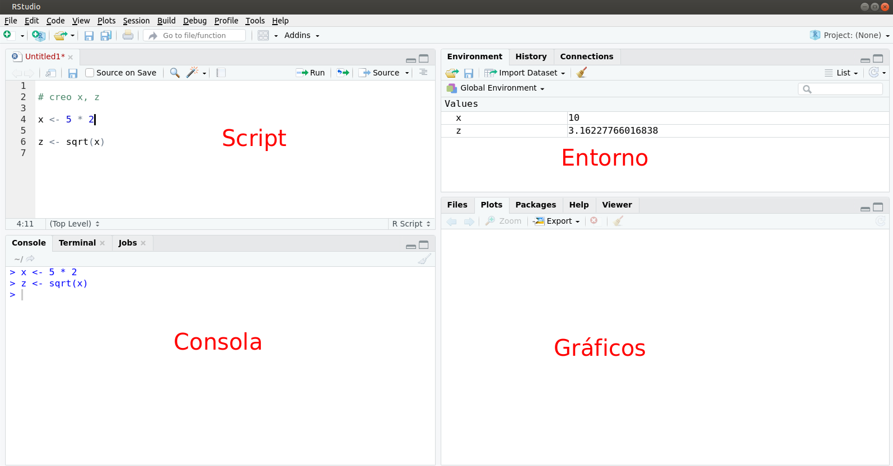

# Introducción

Este tutorial pretende guiarte para aprender a usar R y Rstudio, correr comandos de R, crear objetos en R, escribir tus propias funciones de R y scripts, cargar y usar paquetes de R, analizar y graficar datos.

# ¿Qué es R?

`r icon::fa("chart-area", size=2, color="#756bb1")`  &nbsp; Programa estadístico: análisis 


`r icon::fa("code", size=2, color="#2c7fb8")`  &nbsp; Lenguaje de programación: sintaxis


`r icon::fa("creative-commons-nc", size=2, color="#636363")` &nbsp; Software gratuito, se desacarga desde [CRAN](http://www.r-project.org)


`r icon::fa("osi", size=2, color="#31a354")` &nbsp; Software libre: licencia [GNU](https://es.wikipedia.org/wiki/GNU_General_Public_License). Libertad de uso, modificación y  distribución.


`r icon::fa("github", size=2)` &nbsp; Comunidad mundial: lo usa y mejora. Casi 20.000 paquetes en [CRAN]((https://cran.r-project.org/web/packages/)) y [github](https://github.com/)


`r icon::fa("meetup", size=2, color="#de2d26")` &nbsp; Comunidad en Uruguay: [meetup R-Ladies](https://www.meetup.com/es-ES/rladies-montevideo/) y [meetup GURU](https://www.meetup.com/es-ES/GURU-mvd/)


## Curva de aprendizaje

Al inicio suele ser empinada

<iframe src="https://giphy.com/embed/xT5LMNsvvJzIB77S0g" width="680" height="366" frameBorder="0" class="giphy-embed" allowFullScreen></iframe><p><a href="https://giphy.com/gifs/season-9-the-simpsons-9x23-xT5LMNsvvJzIB77S0g"></a></p>

## Ayuda

Espero este tutorial te sirva de ayuda.

<iframe src="https://giphy.com/embed/l2Jee8WOulPSBZwaI" width="680" height="366" frameBorder="0" class="giphy-embed" allowFullScreen></iframe><p><a href="https://giphy.com/gifs/season-9-the-simpsons-9x23-l2Jee8WOulPSBZwaI"></a></p>

## Consola

Al abrir R - varía según el sistema operativo- aparece la consola donde se ejecuta el código R, es decir, las órdenes para que el programa ejecute. En las primeras líneas aparece un mensaje de bienvenida donde se puede leer la versión de R que se está usando.

 
Esta imagen muestra como se ve R en Linux. 

## Prompt

`r icon::fa("greater-than")` El símbolo de 'mayor' indica que R está listo para recibir una orden

## Rstudio

Para facilitar el uso de R se utilizan editores de sintaxis que hacen todo más fácil. Desde hace algunos años el más popular mundialmente es Rstudio.

Al abrir Rstudio se muestran los cuatro cuadrantes:

- Script: donde se escribe el código R
- Consola: donde se ejecuta el código R
- Entorno: en la pestaña Enviroment se visualizan los objetos en memoria
- Gráficos: en la pestaña Plots se muestran los gráficos creados



En realidad, Rstudio es mucho más que un simple editor de sintaxis, es un IDE (integrated development environment) entorno de desarrollo integrado que permite muchas más cosas que ejecutar código R. Más adelante veremos algunas de las bondades que nos ofrece esta herramienta.

Un recurso muy útil para empezar a usarlo es la [cheatsheet](https://resources.rstudio.com/the-essentials-of-data-science/rstudio-ide)

La interfaz de RStudio es simple. En el panel de la consola después del prompt se escribe una línea de código de R y se hace click en la tecla entrer para correrlo y se mostrará el resultado. El código R se llama comando porque encomienda a la computadora a hacer algo. 

Then RStudio displays a fresh prompt for your next command. For example, if you type 1 + 1 and hit Enter, RStudio will display:
```{r}
5 + 2
```

```{r}
1:100
```


<!-- You’ll notice that a [1] appears next to your result. R is just letting you know that this line begins with the first value in your result. Some commands return more than one value, and their results may fill up multiple lines. For example, the command 100:130 returns 31 values; it creates a sequence of integers from 100 to 130. Notice that new bracketed numbers appear at the start of the second and third lines of output. These numbers just mean that the second line begins with the 14th value in the result, and the third line begins with the 25th value. You can mostly ignore the numbers that appear in brackets -->

<!-- the colon operator (:) returns every integer between two integers. It is an easy way to create a sequence of numbers.  -->

<!-- If you type an incomplete command and press Enter, R will display a + prompt, which means R is waiting for you to type the rest of your command. Either finish the command or hit Escape to start over: -->

<!-- If you type a command that R doesn’t recognize, R will return an error message. If you ever see an error message, don’t panic. R is just telling you that your computer couldn’t understand or do what you asked it to do. You can then try a different command at the next prompt -->

<!-- R treats the hashtag character, #, in a special way; R will not run anything that follows a hashtag on a line. This makes hashtags very useful for adding comments and annotations to your code. Humans will be able to read the comments, but your computer will pass over them. The hashtag is known as the commenting symbol in R. -->

<!-- For the remainder of the book, I’ll use hashtags to display the output of R code. I’ll use a single hashtag to add my own comments and a double hashtag, ##, to display the results of code. I’ll avoid showing >s and [1]s unless I want you to look at them. -->


<!-- Exercise 2.1 (Magic with Numbers) That’s the basic interface for executing R code in RStudio. Think you have it? If so, try doing these simple tasks. If you execute everything correctly, you should end up with the same number that you started with: -->

<!--     Choose any number and add 2 to it. -->
<!--     Multiply the result by 3. -->
<!--     Subtract 6 from the answer. -->
<!--     Divide what you get by 3.  -->

<!-- Throughout the book, I’ll put exercises in chunks, like the one above. I’ll follow each exercise with a model answer, like the one below. -->
<!-- Solution. You could start with the number 10, and then do the following steps:  -->


## Script

- Un script permite volver a reproducir nuestro análisis o que otra persona lo haga.
- Un archivo donde se escribe la sintaxis.
- Tendrá una extensión .R 
- Es clave comentar el código, los comentarios deben ir precedidos por **#**.
- Los comentarios se verán de un color diferente al código, incluso cuando se comenta parte de un código


<!-- Es necesario siempre usar comillas para indicar nombres de archivos como en este caso. Tanto las comillas dobles (") como las simples (') sirven. -->


## Nuevo script

 

## ¿Cómo interactuamos con R?

- Las órdenes elementales de R consisten en expresiones o asignaciones. 


- Una **expresión**, se evalúa, se imprime el resultado y su valor se pierde. 
```{r message=FALSE, warning=FALSE, paged.print=FALSE}
2 + 3
```


- Una **asignación**, crea un objeto y no se imprime el resultado.
```{r }
x <- 2 + 3
```


- Una asignación se hace utilizando el símbolo: `r icon::fa("less-than")``r icon::fa("minus")`  o también con el símbolo  **=** 

- Otros programas estadísticos muestran directamente los resultados, R los guarda en un **'objeto'**. 


- Ejecuto el nombre del objeto para imprimir el resultado
```{r }
x 
```


## Primeros comandos

¿Cómo enviamos el código del script a la consola?

Para ejecutar una sola línea: colocar el **cursor sobre esa línea** y ejecutar **Ctrl + ENTER**.


Si son varias líneas de código: **seleccionarlas todas** y ejecutar **Ctrl + ENTER**.


## Calculadora


- R se puede usar como calculadora
--

- Además de los operadores aritméticos, trae funciones matemáticas

```{r}
# valor absoluto
abs(-1)
```
--

```{r}
# logaritmo
log(1)
```
--
```{r}
# exponencial
exp(0)
```
--
```{r}
# raíz cuadrada
sqrt(9)
```


## Funciones


Una  función  es un  conjunto  de  **instrucciones**  que  operan  sobre unos **argumentos** y producen un **resultado**.

Una función esconde líneas de código que permite reutilizarlo una y otra vez de manera sencilla.

Las funciones tienen **nombres** descriptivos -en inglés- y se acompañan de **paréntesis curvos**.

Por ejemplo, **sqrt** es la abreviación de square root

Dentro de los paréntesis se definen los valores de sus argumentos.

La mayoría tiene al menos un argumento obligatorio y el resto con valores por defecto.

Se puede utilizar la ayuda de R para saber qué hace una función
```{r}
?sqrt 
help("sqrt")
```

<!-- Las funciones de R son los comandos de Stata pero a diferencia de este último, se necesitan paréntesis rectos para llamarlas. -->

## Paquetes

Por defecto vienen precargadas una serie de funciones que están en el paquete 'base'.

Las funciones en R se organizan en paquetes según temas o disciplinas.

Los paquetes debe instalarse en R una vez pero es necesario cargarlos en cada sesión (cada vez que abrimos R). 

Hay millones de funciones si todas estuvieran precargadas, no habría suficiente memoria RAM para trabajar.

Existen paquetes de tan variadas disciplinas que es muy probable que utilicemos relativamente pocos. 

Podemos consultar los paquetes disponibles escribiendo la función available.packages() 

También podemos generar nuestras propias funciones e incluso crear un paquete de R!

## Consejos

- La curva de aprendizaje de R al comienzo suele resultar muy empinada. 

¿Cómo podemos evitar o superar la frustración?

- **Usá** R a diario.
- **Traducí** a R una sintaxis sencilla de otro programa que conozcas.
- **Escribí** tus sintaxis en un script y **comentalas** detalladamente (#).
- **Reutilizá** sintaxis existentes.
- Recurrí a los **foros** y a la ayuda de R para encontrar las soluciones a los problemas que te surjan
- Prestá atención a los **mensajes** de error y advertencia.


## Atajos de teclado


