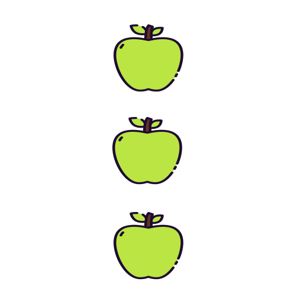

<!-- Now let's talk details. -->

<!-- xfun -->

<!-- https://cran.r-project.org/web/packages/xfun/vignettes/xfun.html -->

# R Base

```{r klippy, echo=FALSE, include=TRUE}
klippy::klippy(position = c('top', 'left'), tooltip_message = 'Click to copy', tooltip_success = 'Done')
```

```{r, include=FALSE, echo = FALSE}
text_spec2 <- function(x = "x"){
  kableExtra::text_spec(x, background = "#b3e2cd", bold = F)
}
```

<center>

</center>

Base R refiere a la colección de funciones que vienen por defecto cuando instalamos R y queda disponibles para usar cada vez que abrimos el programa. Podemos decir que esas fuciones son las que contiene el paquete Base. El resto de las funciones vienen en paquetes que debemos instalar y luego en cada nueva sesión, cargarlos.

# Objetos

R es un programa **'orientado a objetos'**: variables, datos, funciones, resultados, etc., se guardan en la memoria RAM en forma de objetos con un nombre específico sin usar archivos temporales. 

Cada clase de objeto tiene diferentes atributos que determinan la forma en que trabajan dentro de R, es decir, define cuáles funciones se le pueden aplicar. 

Estos objetos se pueden modificar o manipular con **operadores** y **funciones** --que a su vez son objetos--. 

Bajo este término se esconde la simplicidad y flexibilidad de R. 

Algunas de las clases más comunes de objetos son: 'integer', 'numeric', 'character', 'logical' (son vectores), 'matrix', 'data.frame', 'list' y 'function'.


## Tipo de objetos

La cantidad de clases de objetos es muy grande y crece permanentemente a medida que se crean nuevos paquetes.


| Objeto      | Dimensión o largo           | Tipo de elementos | Ejemplo
|---------------|:-------------:|:------:|:------:|
| Vector    | length() | similares |`r icon::fa_ellipsis_v(colour="red", size=3)` |
| Matriz   | dim() | similares |   `r icon::fa_ellipsis_v(colour="red", size=3)``r icon::fa_ellipsis_v(colour="red", size=3)` |
| Marco de datos    | dim() | diferentes |`r icon::fa_ellipsis_v(colour="red", size=3)``r icon::fa_ellipsis_v(colour="blue", size=3)` `r icon::fa_ellipsis_v(colour="green", size=3)`|
| Lista   | length() | diferentes |`r icon::fa_circle(colour="red")` <br> `r icon::fa_circle(colour="blue")` <br> `r icon::fa_circle(colour="green")`| 

## Vectores 

{ width=15% } 

Un vector es una `r text_spec2("colección de uno o más objetos del mismo tipo")` (números o caracteres pero no ambos). Un escalar también es un vector en R.


### c()

- Crea un vector

- Según sus elementos será la clase del vector: *character*, *numeric*, *integer*, *logical*

- Cada elemento va separado por una coma

- Con la función **class()** compruebo que tipo de objeto es


## Vector

```{r}
x <- c(15, 16, 17, 19)
x
class(x)
```

```{r}
y <- x / 2
y
class(y) # numeric porque contiene decimales
```


## Vector

Para el caso de "palabras" ("strings"), la clase "character" es la que utiliza R para manejar este tipo de objetos. Al igual que en la mayoría de los lenguajes de programación, R utiliza las comillas dobles (") o simples (') para delimitar un string. 

<!-- # Nótese que al usar las comillas se puede incluir cualquier caracter dentro,  -->
<!-- # sin tener que preocuparse de que R lo interprete como un comando. Es decir,  -->
<!-- # se toma lo que está entre comillas de forma literal, razón por la cual  -->
<!-- # estos tipos de objetos son llamados "strings literals" muchas veces. -->

```{r}
w <- c("15", "16", "17", "19")
w
class(w)
```

```{r}
w <- c("lunes", "martes", "miércoles", "viernes")
w
class(w)
```


## Ejemplo vectores

Comparemos algunas características de R con otros software estadísticos como Stata y SPSS.
Esta tabla la tomé de [Princeton University](https://imgv2-2-f.scribdassets.com/img/document/353774131/original/365bf63409/1573401036?v=1), la traduje y le agregué el año de creación.

|Características | R | SPSS | Stata |
|-----------------|-------|----------|----------------|
| Año | 1993| 1968 | 1985|
| Curva aprendizaje | Muy empinada | Plana  | Empinada |
| Interfaz| Programación| Point and click | Programación/Point and click |
| Manipulación de datos| Avanzada | Moderada | Avanzada |
| Análisis de datos| Potente/Versátil | Potente | Potente|
| Gráficos| Excelentes|Muy buenos | Muy buenos |
|Software libre| 1| 0| 0 |
|Costo| Gratuito| Muy costoso| Accesible |

```{r}
anio <- c(1993, 1968, 1985)
software_libre <- c(T, F, F)
costo <- c("gratuito", "costoso", "accesible")
```

```{r}
length(anio)
class(anio)
```

## Coerción

Como mencionamos anteriormente, estos elementos deben ser todos de la misma clase. Si se combinan objetos de diferente clase, R reasigna los elementos a la clase apropiada. Si contiene números y texto el vector será de clase `character`.

La coerción es necesaria para el funcionamiento correcto de R. Al mismo tiempo puede ser una fuente de errores si no se tiene en cuenta.

Un texto sin comillas en R es un objeto (siempre que cumpla las reglas de un nombre de objeto).


## Vectorización

R vectoriza las operaciones de manera que si sumo un número a un vector numérico, a cada elemento del vector le sumará ese número. Esta propiedad es una ventaja ya que permite evitar loops en muchas de situaciones y de esta manera se obtiene un código más 'limpio' y eficiente.

```{r vecto}
x <- -1:4 
x
```

El operador  `r text_spec2(":")` sirve para generar vectores numéricos

```{r}
x + 5 # adiciono 5 
```

```{r}
x * 3 # multiplico por 3 
```

## Funciones descriptivas de un vector numérico

`r text_spec2("length(x)")`: devuelve la cantidad de elementos de x

`r text_spec2("sort(x, decreasing = F)")`: ordena los elementos de manera creciente 

`r text_spec2("sum(x)")`: devuelve la suma de los elementos de x

`r text_spec2("max(x)")`: máximo

`r text_spec2("min(x)")`: mínimo

`r text_spec2("mean(x)")`: promedio aritmético de x

`r text_spec2("median(x)")`: mediana de x

`r text_spec2("sd(x)")`: desvío estándar de x

`r text_spec2("var(x)")`: varianza de x

`r text_spec2("summary(x)")`: resumen descriptivo de x (mínimo, máximo, media, mediana, cuartiles)

## Data frame

{ width=15% } 

- Puede verse como un conjunto de vectores de diferente tipo pero de igual largo.

```{r  class.source='klippy'}
# vector numeric
anio <- c(1993, 1968, 1985)

# vector lógico

software_libre <- c(T, F, F)

# vector character
costo <- c("gratuito", "costoso", "accesible")


# data frame
df <- data.frame(anio, software_libre, costo)
class(df)
```

```{r}
knitr::kable(df)
```

- En un conjunto de datos, cada variable/columna es un vector. 

```{r}
class(df$anio); class(df$software_libre); class(df$costo)
```

- En general el data frame vendrá dado en un archivo.

## Explorar los datos

```{r eval=FALSE}
# dimensiones del objeto
dim()

```
```{r eval=FALSE}
# nombres de variables
names()

# estructura del objeto
str()

# resumen descriptivo de variables
summary()
```

## Guardar objeto en formato RData

```{r eval=FALSE, echo=TRUE, message=FALSE, warning=FALSE}
save(df, file = "data/df.RData") 
```

El primer elemento debe ser un **objeto**. Podrían ser más de uno.

Es necesario nombrar el argumento **'file'** definiendo ruta y nombre de archivo.

Si en **file** solo se define el nombre del archivo, se guarda en el directorio de trabajo actual: **getwd()**

El **nombre** del objeto y el archivo pueden coincidir, pero no necesariamente.

Un archivo Rdata es más **liviano** que cualquier otro formato externo.
