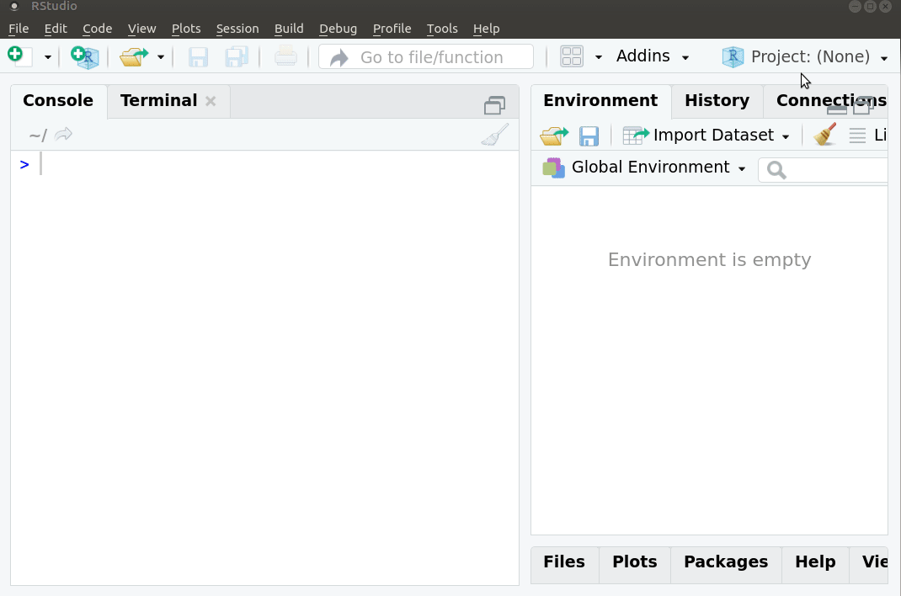
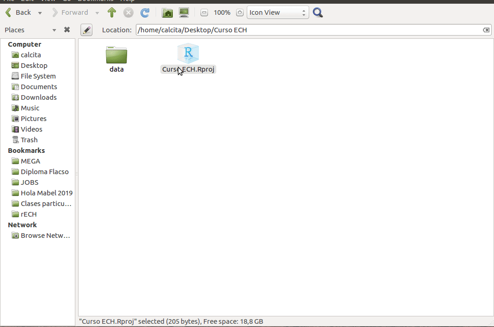

# Trabajar en proyecto

## Crear proyecto

## Abrir proyecto

## Crear script

## Flujo de trabajo

Organizar los archivos en carpetas es clave para trabajar de manera ordenada y eficiente.

Si tenemos archivos con los datos, scripts y gráficos conviene crear una carpeta por cada una de estas categorías

