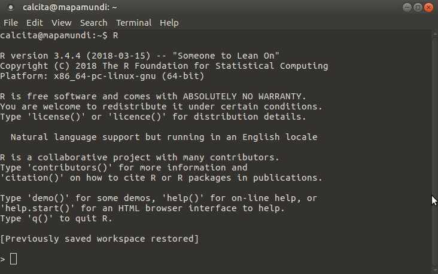
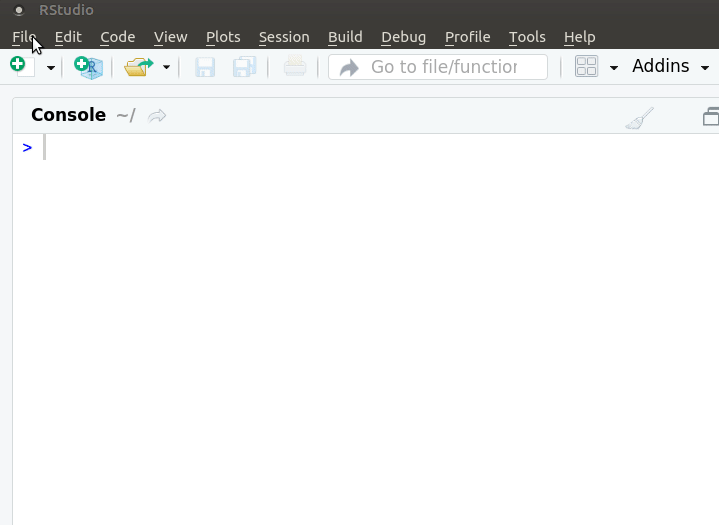
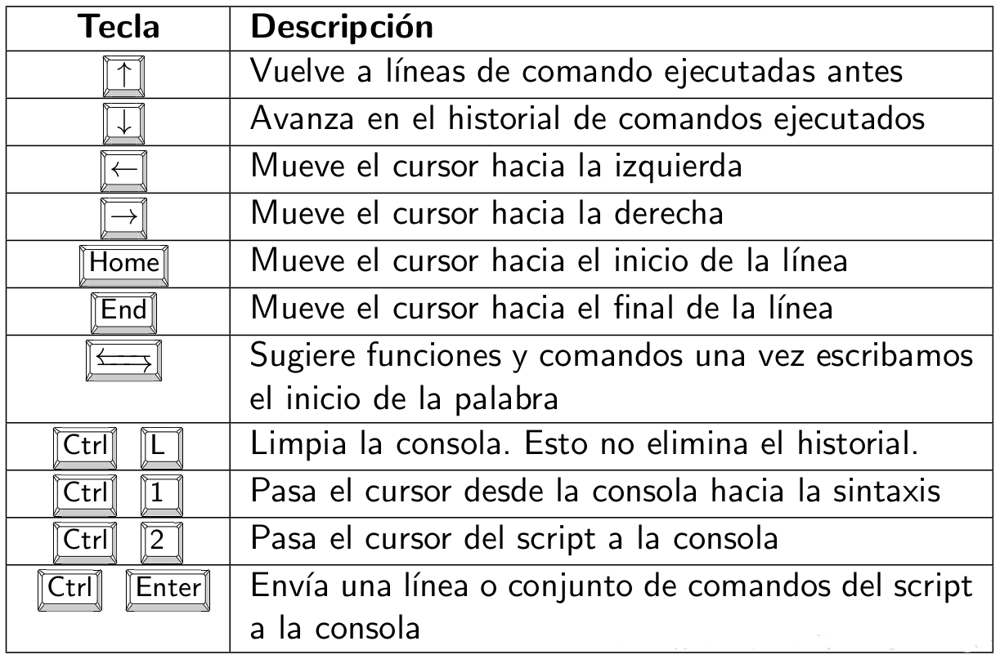

# Introducción

<!--  -->

Este tutorial pretende guiarte para aprender a usar R y Rstudio, correr comandos de R, crear objetos en R, escribir tus propias funciones de R y scripts, cargar y usar paquetes de R, analizar y graficar datos.


# ¿Qué es R?

<!--html_preserve--><i class="fas  fa-chart-area fa-2x " style="color:#756bb1;"></i><!--/html_preserve-->  &nbsp; Programa estadístico: análisis 


<!--html_preserve--><i class="fas  fa-code fa-2x " style="color:#2c7fb8;"></i><!--/html_preserve-->  &nbsp; Lenguaje de programación: sintaxis


<!--html_preserve--><i class="fab  fa-creative-commons-nc fa-2x " style="color:#636363;"></i><!--/html_preserve--> &nbsp; Software gratuito, se desacarga desde [CRAN](http://www.r-project.org)


<!--html_preserve--><i class="fab  fa-osi fa-2x " style="color:#31a354;"></i><!--/html_preserve--> &nbsp; Software libre: licencia [GNU](https://es.wikipedia.org/wiki/GNU_General_Public_License). Libertad de uso, modificación y  distribución.


<!--html_preserve--><i class="fab  fa-github fa-2x "></i><!--/html_preserve--> &nbsp; Comunidad mundial: lo usa y mejora. Casi 20.000 paquetes en [CRAN]((https://cran.r-project.org/web/packages/)) y [github](https://github.com/)


<!--html_preserve--><i class="fab  fa-meetup fa-2x " style="color:#de2d26;"></i><!--/html_preserve--> &nbsp; Comunidad en Uruguay: [meetup R-Ladies](https://www.meetup.com/es-ES/rladies-montevideo/) y [meetup GURU](https://www.meetup.com/es-ES/GURU-mvd/)


## Curva de aprendizaje

Al inicio suele ser empinada

<iframe src="https://giphy.com/embed/xT5LMNsvvJzIB77S0g" width="680" height="366" frameBorder="0" class="giphy-embed" allowFullScreen></iframe><p><a href="https://giphy.com/gifs/season-9-the-simpsons-9x23-xT5LMNsvvJzIB77S0g"></a></p>

## Ayuda

Espero este tutorial te sirva de ayuda.

<iframe src="https://giphy.com/embed/l2Jee8WOulPSBZwaI" width="680" height="366" frameBorder="0" class="giphy-embed" allowFullScreen></iframe><p><a href="https://giphy.com/gifs/season-9-the-simpsons-9x23-l2Jee8WOulPSBZwaI"></a></p>

## Consola

Al abrir R - varía según el sistema operativo- aparece la consola donde se ejecuta el código R, es decir, las órdenes para que el programa ejecute. En las primeras líneas aparece un mensaje de bienvenida donde se puede leer la versión de R que se está usando.

 
Esta imagen muestra como se ve R en Linux. 

Lo primero que verás en la consola de R es un mensaje de inicio, seguido por un “>” y un cursor parpadeante. R ejecutará los comandos que escribas y devolverá un resultado. El resultado no siempre es el deseado podría ser un error o un warning.


## Prompt

<!--html_preserve--><i class="fas  fa-greater-than "></i><!--/html_preserve--> El símbolo de 'mayor' indica que R está listo para recibir una orden


## Rstudio

Para facilitar el uso de R se utilizan editores de sintaxis que hacen todo más fácil. Desde hace algunos años el más popular mundialmente es Rstudio.

RStudio es un entorno de desarrollo integrado (IDE por sus siglas en inglés) que al igual que R es gratuito de código abierto. RStudio proporciona un editor incorporado, es multiplataforma y permite la integración de control de versiones y gestión de proyectos.

Al abrir Rstudio se muestran 3 cuadrantes:


    La consola interactiva de R (a la izquierda)
    Ambiente/Historial (en la esquina superior derecha)
    Archivos/Gráficos/Paquetes/Ayuda/Visor (abajo a la derecha)

Lo usual es no escribir el código directamente en la consola y por lo tanto trabajarás con 4 cuadrantes 

- Script: donde se escribe el código R
- Consola: donde se ejecuta el código R (a la izquiera)
- Entorno/Historial: en la pestaña Enviroment se visualizan los objetos en memoria (derecha arriba)
- Archivos/Gráficos/Paquetes/Ayuda/Visor: en la pestaña Plots se muestran los gráficos creados (derecha abajo)


En realidad, Rstudio es mucho más que un simple editor de sintaxis, es un IDE (integrated development environment) entorno de desarrollo integrado que permite muchas más cosas que ejecutar código R. Más adelante veremos algunas de las bondades que nos ofrece esta herramienta.

Un recurso muy útil para empezar a usarlo es la [cheatsheet](https://resources.rstudio.com/the-essentials-of-data-science/rstudio-ide)

## ¿Cómo interactuamos con R?

<center>

</center>

La interfaz de RStudio es simple. En el panel de la consola después del prompt se escribe una línea de código de R y se hace click en la tecla entrer para correrlo y se mostrará el resultado. El código R se llama comando porque encomienda a la computadora a hacer algo. 

Si escribís en la consola, luego del prompt, 5 + 2, Rstudio mostrará:

```r
5 + 2
```

```
## [1] 7
```

Es una orden válida y por lo tanto R muestra la respuesta, precedid de un “[1]”. Esto indica que el 7 es el primer resultado y en este caso es el único. 

Pero si escribís los primeros 50 números enteros, el 1 es el primer resultado, el 23 es el resultado 23° y el 45 es el 45°. Sirve para facilitar la lectura de los resultados pero podés ignorarlos si te confunden.


```r
1:50
```

```
##  [1]  1  2  3  4  5  6  7  8  9 10 11 12 13 14 15 16 17 18 19 20 21 22 23 24 25
## [26] 26 27 28 29 30 31 32 33 34 35 36 37 38 39 40 41 42 43 44 45 46 47 48 49 50
```

El operador ":" devuelve todos los enteros entre dos números enteros. Es una manera fácil de contruir una secuencia de números.

- Las órdenes elementales de R consisten en expresiones o asignaciones. 


- Una **expresión**, se evalúa, se imprime el resultado y su valor se pierde. 

```r
2 + 3
```

```
## [1] 5
```


- Una **asignación**, crea un objeto y no se imprime el resultado.

```r
x <- 2 + 3
```


- Una asignación se hace utilizando el símbolo: <!--html_preserve--><i class="fas  fa-less-than "></i><!--/html_preserve--><!--html_preserve--><i class="fas  fa-minus "></i><!--/html_preserve-->  o también con el símbolo  **=** 

- Otros programas estadísticos muestran directamente los resultados, R los guarda en un **'objeto'**. 


- Ejecuto el nombre del objeto para imprimir el resultado

```r
x 
```

```
## [1] 5
```


## Calculadora


- R se puede usar como calculadora

    Paréntesis: (, )
    Exponente: ^ o **
    División: /
    Multiplicación: *
    Suma: +
    Resta: -

- Además de los operadores aritméticos, trae funciones matemáticas


```r
# valor absoluto
abs(-1)
```

```
## [1] 1
```
--


```r
# logaritmo
log(1)
```

```
## [1] 0
```
--

```r
# exponencial
exp(0)
```

```
## [1] 1
```
--

```r
# raíz cuadrada
sqrt(9)
```

```
## [1] 3
```

Los números pequeños o grandes tienen una notación científica:
2e-4 es 2*10 a la -4

## Funciones


Una  función  es un  conjunto  de  **instrucciones**  que  operan  sobre unos **argumentos** y producen un **resultado**.

Una función esconde líneas de código que permite reutilizarlo una y otra vez de manera sencilla.

Las funciones tienen **nombres** descriptivos -en inglés- y se acompañan de **paréntesis curvos**.

Por ejemplo, **sqrt** es la abreviación de square root

Dentro de los paréntesis se definen los valores de sus argumentos.

La mayoría tiene al menos un argumento obligatorio y el resto con valores por defecto.

Se puede utilizar la ayuda de R para saber qué hace una función

```r
?sqrt 
help("sqrt")
```

<!-- Las funciones de R son los comandos de Stata pero a diferencia de este último, se necesitan paréntesis rectos para llamarlas. -->


## Script

- Un script permite volver a reproducir nuestro análisis o que otra persona lo haga.
- Un archivo donde se escribe la sintaxis.
- Tendrá una extensión .R 
- Es clave comentar el código, los comentarios deben ir precedidos por el símbolo de numeral (hash en inglés) **#**.
- Los comentarios se verán de un color diferente al código, incluso cuando se comenta parte de un código
- Es necesario siempre usar comillas para indicar nombres de archivos como en este caso. Tanto las comillas dobles (") como las simples (') sirven. 


## Nuevo script

 

¿Cómo enviamos el código del script a la consola?

Para ejecutar una sola línea: colocar el **cursor sobre esa línea** y ejecutar **Ctrl + ENTER**.


Si son varias líneas de código: **seleccionarlas todas** y ejecutar **Ctrl + ENTER**.


Cada vez que presionas Enter y R te muestra un “+” en lugar de “>”, significa que está esperando que completes el comando. Si deseas cancelar un comando, simplemente presiona “Esc” y RStudio te devolverá el “>” prompt.


## Paquetes

Por defecto vienen precargadas una serie de funciones que están en el paquete 'base'.

Las funciones en R se organizan en paquetes según temas o disciplinas.

Los paquetes debe instalarse en R una vez pero es necesario cargarlos en cada sesión (cada vez que abrimos R). 

Hay millones de funciones si todas estuvieran precargadas, no habría suficiente memoria RAM para trabajar.

Existen paquetes de tan variadas disciplinas que es muy probable que utilicemos relativamente pocos. 

Podemos consultar los paquetes disponibles escribiendo la función available.packages() 

También podemos generar nuestras propias funciones e incluso crear un paquete de R!

Para profundizar sobre el uso de paquetes ve a la sección ...

## Consejos

- La curva de aprendizaje de R al comienzo suele resultar muy empinada. 

¿Cómo podemos evitar o superar la frustración?

- **Usá** R a diario.
- **Traducí** a R una sintaxis sencilla de otro programa que conozcas.
- **Escribí** tus sintaxis en un script y **comentalas** detalladamente (#).
- **Reutilizá** sintaxis existentes.
- Recurrí a los **foros** y a la ayuda de R para encontrar las soluciones a los problemas que te surjan
- Prestá atención a los **mensajes** de error y advertencia.


## Atajos de teclado
<center>

</center>


