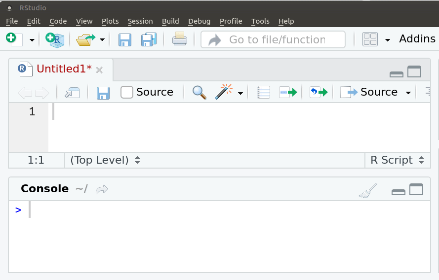

# Introducción

¿Qué es R?

<!--html_preserve--><i class="fas  fa-chart-area fa-2x " style="color:#756bb1;"></i><!--/html_preserve-->  Programa estadístico: análisis 


<!--html_preserve--><i class="fas  fa-code fa-2x " style="color:#2c7fb8;"></i><!--/html_preserve-->  Lenguaje de programación: sintaxis


<!--html_preserve--><i class="fab  fa-creative-commons-nc fa-2x " style="color:#636363;"></i><!--/html_preserve--> Software gratuito, se desacarga desde [CRAN](http://www.r-project.org)


<!--html_preserve--><i class="fab  fa-osi fa-2x " style="color:#31a354;"></i><!--/html_preserve--> Software libre: licencia [GNU](https://es.wikipedia.org/wiki/GNU_General_Public_License). Libertad de uso, modificación y  distribución.


<!--html_preserve--><i class="fab  fa-github fa-2x "></i><!--/html_preserve--> Comunidad mundial: lo usa y mejora. Casi 20.000 paquetes en [CRAN]((https://cran.r-project.org/web/packages/)) y [github](https://github.com/)


<!--html_preserve--><i class="fab  fa-meetup fa-2x " style="color:#de2d26;"></i><!--/html_preserve--> Comunidad en Uruguay: [meetup R-Ladies](https://www.meetup.com/es-ES/rladies-montevideo/) y [meetup GURU](https://www.meetup.com/es-ES/GURU-mvd/)


# Curva de aprendizaje

Al inicio suele ser empinada

<iframe src="https://giphy.com/embed/xT5LMNsvvJzIB77S0g" width="680" height="366" frameBorder="0" class="giphy-embed" allowFullScreen></iframe><p><a href="https://giphy.com/gifs/season-9-the-simpsons-9x23-xT5LMNsvvJzIB77S0g"></a></p>

# Ayuda

Espero este tutorial te sirva de ayuda.

<iframe src="https://giphy.com/embed/l2Jee8WOulPSBZwaI" width="680" height="366" frameBorder="0" class="giphy-embed" allowFullScreen></iframe><p><a href="https://giphy.com/gifs/season-9-the-simpsons-9x23-l2Jee8WOulPSBZwaI"></a></p>

# Consola

Al abrir R - varía según el sistema operativo- aparece la consola donde se ejecuta el código R, es decir, las órdenes para que el programa ejecute. En las primeras líneas aparece un mensaje de bienvenida donde se puede leer la versión de R que se está usando.

 
Esta imagen muestra como se ve R en Linux. 

## Prompt

<!--html_preserve--><i class="fas  fa-greater-than "></i><!--/html_preserve--> El símbolo de 'mayor' indica que R está listo para recibir una orden

# Rstudio

Para facilitar el uso de R se utilizan editores de sintaxis que hacen todo más fácil. Desde hace algunos años el más popular mundialmente es Rstudio.

Al abrir Rstudio se muestran los cuatro cuadrantes:

- Script: donde se escribe el código R
- Consola: donde se ejecuta el código R
- Entorno: en la pestaña Enviroment se visualizan los objetos en memoria
- Gráficos: en la pestaña Plots se muestran los gráficos creados


En realidad, Rstudio es mucho más que un simple editor de sintaxis, es un IDE (integrated development environment) entorno de desarrollo integrado que permite muchas más cosas que ejecutar código R. Más adelante veremos algunas de las bondades que nos ofrece esta herramienta.

Un recurso muy útil para empezar a usarlo es la [cheatsheet](https://resources.rstudio.com/the-essentials-of-data-science/rstudio-ide)


# Script

- Un script permite volver a reproducir nuestro análisis o que otra persona lo haga.
- Un archivo donde se escribe la sintaxis.
- Tendrá una extensión .R 
- Es clave comentar el código, los comentarios deben ir precedidos por **#**.
- Los comentarios se verán de un color diferente al código, incluso cuando se comenta parte de un código


<!-- Es necesario siempre usar comillas para indicar nombres de archivos como en este caso. Tanto las comillas dobles (") como las simples (') sirven. -->


## Nuevo script

 

# ¿Cómo interactuamos con R?

- Las órdenes elementales de R consisten en expresiones o asignaciones. 


- Una **expresión**, se evalúa, se imprime el resultado y su valor se pierde. 

```r
2 + 3
```

```
## [1] 5
```


- Una **asignación**, crea un objeto y no se imprime el resultado.

```r
x <- 2 + 3
```


- Una asignación se hace utilizando el símbolo: <!--html_preserve--><i class="fas  fa-less-than "></i><!--/html_preserve--><!--html_preserve--><i class="fas  fa-minus "></i><!--/html_preserve-->  o también con el símbolo  **=** 

- Otros programas estadísticos muestran directamente los resultados, R los guarda en un **'objeto'**. 


- Ejecuto el nombre del objeto para imprimir el resultado

```r
x 
```

```
## [1] 5
```


## Primeros comandos

¿Cómo enviamos el código del script a la consola?

Para ejecutar una sola línea: colocar el **cursor sobre esa línea** y ejecutar **Ctrl + ENTER**.



Si son varias líneas de código: **seleccionarlas todas** y ejecutar **Ctrl + ENTER**.


---
# Calculadora


- R se puede usar como calculadora
--

- Además de los operadores aritméticos, trae funciones matemáticas


```r
# valor absoluto
abs(-1)
```

```
## [1] 1
```
--


```r
# logaritmo
log(1)
```

```
## [1] 0
```
--

```r
# exponencial
exp(0)
```

```
## [1] 1
```
--

```r
# raíz cuadrada
sqrt(9)
```

```
## [1] 3
```

---
# Funciones


Una  función  es un  conjunto  de  **instrucciones**  que  operan  sobre unos **argumentos** y producen un **resultado**.

Una función esconde líneas de código que permite reutilizarlo una y otra vez de manera sencilla.

Las funciones tienen **nombres** descriptivos -en inglés- y se acompañan de **paréntesis curvos**.

Por ejemplo, **sqrt** es la abreviación de square root

Dentro de los paréntesis se definen los valores de sus argumentos.

La mayoría tiene al menos un argumento obligatorio y el resto con valores por defecto.

Se puede utilizar la ayuda de R para saber qué hace una función

```r
?sqrt 
help("sqrt")
```

<!-- Las funciones de R son los comandos de Stata pero a diferencia de este último, se necesitan paréntesis rectos para llamarlas. -->

# Paquetes

Por defecto vienen precargadas una serie de funciones que están en el paquete 'base'.

Las funciones en R se organizan en paquetes según temas o disciplinas.

Los paquetes debe instalarse en R una vez pero es necesario cargarlos en cada sesión (cada vez que abrimos R). 

Hay millones de funciones si todas estuvieran precargadas, no habría suficiente memoria RAM para trabajar.

Existen paquetes de tan variadas disciplinas que es muy probable que utilicemos relativamente pocos. 

Podemos consultar los paquetes disponibles escribiendo la función available.packages() 

También podemos generar nuestras propias funciones e incluso crear un paquete de R!

## Consejos

- La curva de aprendizaje de R al comienzo suele resultar muy empinada. 

¿Cómo podemos evitar o superar la frustración?

- **Usá** R a diario.
- **Traducí** a R una sintaxis sencilla de otro programa que conozcas.
- **Escribí** tus sintaxis en un script y **comentalas** detalladamente (#).
- **Reutilizá** sintaxis existentes.
- Recurrí a los **foros** y a la ayuda de R para encontrar las soluciones a los problemas que te surjan
- Prestá atención a los **mensajes** de error y advertencia.


## Atajos de teclado


