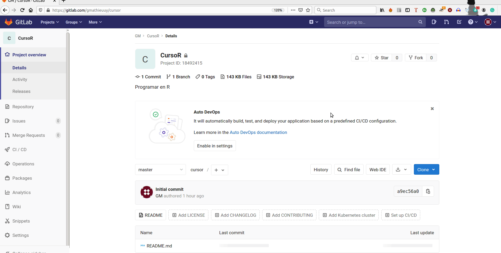
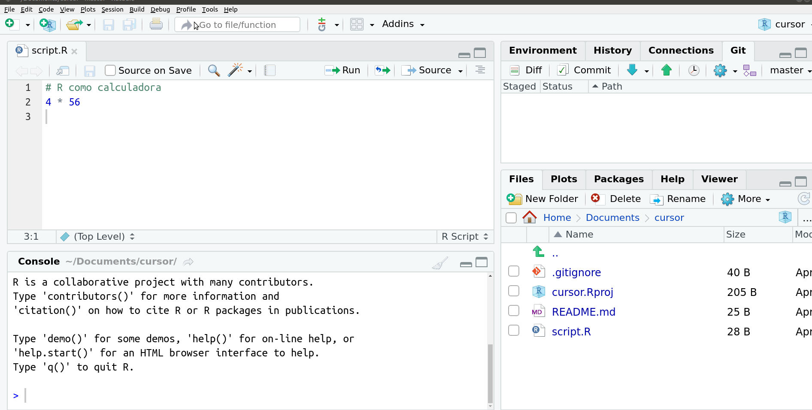

# Control de versiones

Un programa de control de versiones mantiene una copia de los cambios en el código u otro contenido. Esto es útil en caso de que necesitemos revertir algún cambio realizado.  

Seguramente todxs hemos implementado un control de versiones en nuestros proyectos. Por ejemplo, haciendo una tesis y nombrando por fecha al archivo o por el avance alcanzado hasta acumular decenas de archivos similares. Esto tarde o temprano se convierte en un caos de archivos y nos brinda una falsa seguridad de que podremos recuperar algo que quitamos o cambiamos. ¿En qué versión estará? ¿En la de ayer o hoy de mañana?

{ width=50% } 

Si usamos una plataforma como Dropbox estamos en una situación similar, contamos con un historial de archivos en caso de necesitarlo. O con Google Docs tenemos la opción de "version history" que viene a ser algo similar. Una ventaja de Google Docs respecto a Dropbox es que permite editar un mismo documento por varias personas a la vez.

Pero ninguno de estos métodos de control de versiones es lo suficientemente eficiente y menos cuando de programar se trata. Por ello, existen software específicos para el control de versiones, uno de los más populares es git. 

¿Por qué es importante un software de contorl de versiones? Para revertir un cambio realizado y poder trabajar colaborativamente sobre un mismo proyecto sin preocuparnos que alguien borre algún archivo o parte del mismo. Nada se pierde, todo se recupera ... ¿quiénes pensaron en la frase de Drexler? :notes:

Para trabajar con otras personas en un mismo proyecto, es decir, sobre los mismos archivos debemos alojar una copia de estos archivos en un web server que oficia de nube. Dentro de los más populares se encuentran github y gitlab. Así GitHub o Gitlab proporcionan una copia de seguridad de tu trabajo que se puede recuperar si se pierde tu copia local, es decir, aquella que está en computadora. 

Por lo tanto, usar git conjuntamente con Github o Gitlab nos proporciona lo siguiente:

- realizar un seguimiento de los cambios en tu código localmente
- sincronizar entre diferentes versiones de los archivos, esto es, entre tus propias versiones o las de otras personas.
- probar cambios en el código sin perder una versión anterior.
- respaldar tus archivos en la nube (github.com o gitlab.com) 
- compartir tus archivos en la web (github.com o gitlab.com) 

## ¿Qué es git?

Hagamos una analogía entre git y el e-mail. 

E-mail es un protocolo para enviar mensajes online, independientemente de cual servidor de e-mail uses (gmail, hotmail, adinet, etc.).

Git es un protocolo para compartir versiones de tu código, independientemente de cual servidor git uses (github, gitlab, bitbucket).

Así github.com es a git lo que gmail.com es al e-mail.

## Configurar git en Rstudio

En primer lugar debemos indicarle a Rstudio dónde está el ejecutable de git en nuestra computadora. 

<iframe src="https://player.vimeo.com/video/292760320" width="640" height="360" frameborder="0" allow="autoplay; fullscreen" allowfullscreen></iframe>

La manera más sencilla de configurar git para usarlo a través de Rstudio es hacerlo en la terminal que allí se encuentra, independientemente del sistema operativo que tengamos.

Para crear nuestra cuenta de gitlab usamos un nombre de usuarix  y un e-mail, estas es la información que debemos proporcionar en la terminal. Estos comandos que escribimos no son comandos de R sino que serán interpretados por nuestro sistema operativo para configurar git.

    git config --global user.name "tu nombre"
    git config --global user.email "tumail@domain.com"

El script que se en el siguiente gif lo usé para copia estos comandos como ayuda y no cometer un error al pegarlo en la terminal. Una vez allí pegué en la terminal la primera línea y sustituí "tu nombre" por "gmathieuuy" que fue el nombre que utilicé para crear mi cuenta y di enter. Luego sustituí "tumail@domain.com" por el mail "gmathieu@gmx.com" y volví a hacer click en Enter. Así quedó configurado git para usarlo desde Rstudio.

El terminal de RStudio proporciona acceso a la terminal del sistema. Lo que vemos de color verde loro es el nombre de usuarix de mi PC (antes del @) y el nombre de la PC (después del arroba). En celeste se describe la versión de R instalada. El signo de peso me habilita a escribir una orden. El \$ es a la terminal lo que el prompt es a la consola de R.

## Registrarse en gitlab

## Crear un repositorio

En gitlab se llama proyecto y en github se llama repositorio. 

## Clonar un repositorio 

## Commit

## Push 

### Primer commit y push

## Pull

{ width=2% } **Objetivos**

Después de completar esta lección serás capaz de:

Explicar como gihub y git usan los repositorios para alojar y manejar archivos.
Usar el comando git clone para bajar una copia del repositorio a tu computadora.
    
**Requisitos** 

Haber completado la sección de configuración de Git en tu computadora

Haber creado una cuenta en Github.com y recordar usuario y contraseña.

## Crear un proyecto en gitlab

## Crear un repositorio en github

## Instalar git

git es el software de control de versiones. En distribuciones Linux suele venir instalado. En Windows se instala a través del ejecutable.

## Commit y push

Para enviar los cambios que realizamos localmente primero debemos seleccionar los archivos modificados, creados o eliminados, luego hacer commit para lo cual es necesario escribir un mensaje que describa los cambios que realizamos. 

<iframe src="https://player.vimeo.com/video/292639340" width="640" height="360" frameborder="0" allow="autoplay; fullscreen" allowfullscreen></iframe>

Para que un mensaje del commit nos resulte útil debe describir brevemente lo que hicimos y no haber hecho muchas cosas antes de hacer un commit. Podemos volver a una versión anterior del código y para saber a cuál resulta muy útil ese mensaje.

## Pull

Descargar los cambios que otra persona o yo misma desde otra computadora realicé.

<!-- #b2e2e2 -->

{ width=2% } 
Importante

## Historial

## .gitignore

